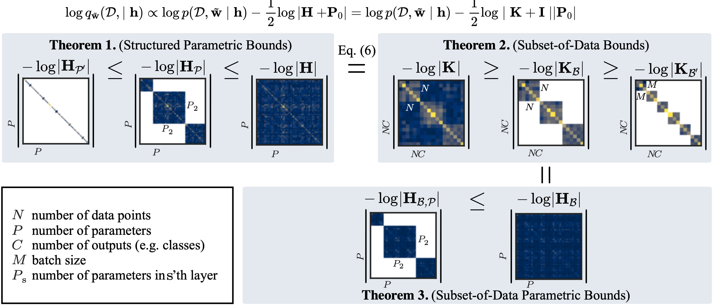
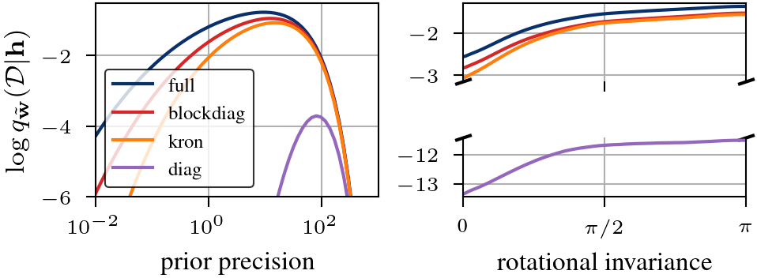
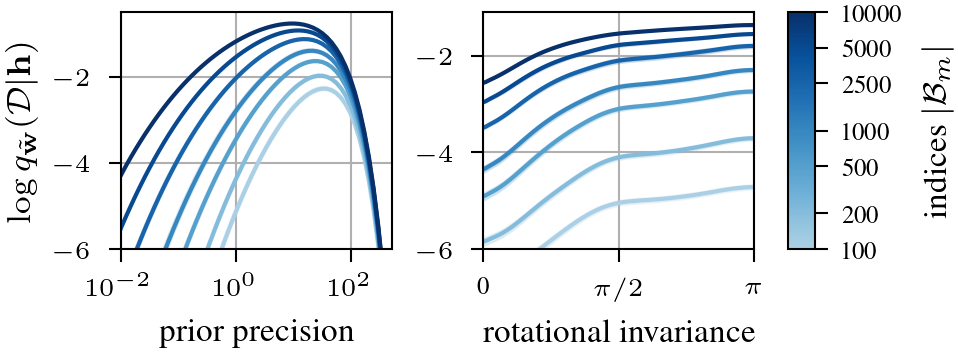

# Stochastic Marginal Likelihood Gradients using Neural Tangent Kernels (ICML'23)
In the paper,  we derive lower bounds of the linearized Laplace approximation to the marginal likelihood that enable SGD-based hyperparameter optimization.
The corresponding estimators and experiments are available in this repository.

[**Stochastic Marginal Likelihood Gradients using Neural Tangent Kernels.**](https://arxiv.org/abs/2306.03968)  
Alexander Immer, Tycho F.A. van der Ouderaa, Mark van der Wilk, Gunnar Rätsch, Bernhard Schölkopf.
In proceedings of ICML 2023.

## Overview

Existing parametric bounds             |  NTK-based stochastic bounds
:-------------------------:|:-------------------------:
  |  

## Setup
We use python>=3.9 and rely on pytorch for the experiments.
The basic dependencies are in `requirements.txt` but might have to be adjusted depending on GPU or CUDA support in the case of torch.
The proposed marginal likelihood estimators are implemented in `dependencies/laplace` and `dependencies/asdl` and are forks of the respective packages [laplace-torch](https://github.com/AlexImmer/Laplace) and [asdl](https://github.com/kazukiosawa/asdl) with modifications for the NTK and lower-bound linearized Laplace marginal likelihood approximations as well as differentiability in asdl.
To install these, move into `dependencies/laplace` and `/asdl` and install locally with `pip install .`.

## Experiments
The experiments, with the exception for the illustrated bounds, rely on `wandb` for tracking and collecting results and might have to be set up separately (see bottom of main runner `classification_image.py`).
The commands to reproduce individual experiments are:
- `scripts/bound_grid_commands.sh` contains commands to compute the slack of bounds for different subset (minibatch) sizes
- `scripts/generate_bound_commands.py > scripts/bound_commands.sh` generates all online visualizations of the bound displayed in the appendix as well es the timing commands displayed in the Pareto figure
- `scripts/generate_cifar_commands.py > scripts/cifar_commands.sh` generates the commands for the CIFAR-10 and -100 table without invariance learning
- `scripts/cifar_commands_lila.sh` are the commands for CIFAR with invariance learning (lila)
- `scripts/generate_tiny_commands.py> scripts/tiny_commands.sh` generates the commands for the TinyImageNet experiments

## Figures
To produce plots, we download the results from wandb so line 15 in `generate_illustration_figures.py` needs to be adjusted to the individual wandb account.
The commands in the main function can be used selectively to produce plots and, by default, produce all of them given that all results are present in wandb.
